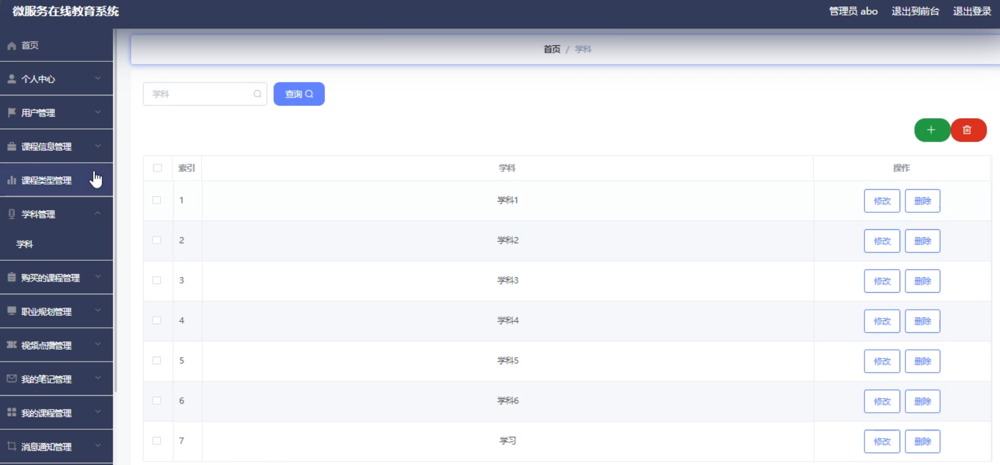
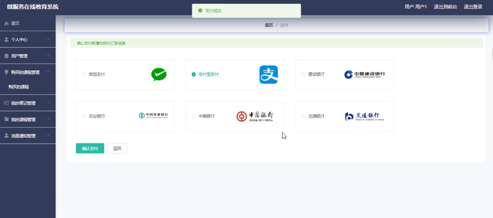

# 基于springboot的在线教育系统

---
### 👉作者QQ ：1556708905 微信：zheng0123Long (支持定制修改、部署调试、定制毕设)

### 👉接网站建设、小程序、H5、APP、各种系统等

---

#### 介绍

本在线教育系统基于先进的Spring Boot框架开发，是一个功能全面、易于扩展的在线学习平台。该系统不仅为广大学生提供了丰富多样的在线课程资源，还为他们提供了职业规划、学习交流等一站式服务。同时，系统也为管理员提供了强大的后台管理功能，确保教学质量和用户体验的持续优化。

#### 技术栈

后端技术栈：Springboot+Mysql+Maven

前端技术栈：Vue+Html+Css+Javascript+ElementUI

开发工具：Idea+Vscode+Navicate

#### 系统功能介绍  
管理员功能模块

个人中心：管理员可以方便地查看、编辑和管理自己的个人信息，确保账号安全。  
用户管理：管理员可以创建、查询、编辑和删除用户账号，设置用户权限，实现精细化的用户管理。  
课程信息管理：管理员可以添加、删除、修改和查询课程信息，包括课程名称、描述、价格等，确保课程信息的准确性和时效性。  
课程类型与学科管理：管理员可以对课程进行分类管理，并管理不同的学科，方便用户查找和选择感兴趣的课程。  
购买的课程管理：管理员可以查看用户购买的课程记录，进行订单管理，确保交易流程的顺畅和安全。  
职业规划管理：管理员可以发布和管理职业规划建议，帮助学生规划学习路径，提升就业竞争力。  
视频管理：管理员可以上传、编辑、删除和查看教学视频，确保视频资源的丰富性和优质性。  
消息通知管理：管理员可以向用户发送系统通知，如课程更新、活动提醒等，确保用户及时获取重要信息。  
学习交流管理：管理员可以管理学习交流区，如论坛、问答等，促进用户之间的互助与合作。  
试卷与试题管理：管理员可以添加、删除、修改和查看在线试卷与试题库，为用户提供多样化的学习检测方式。  
系统管理：管理员可以配置系统参数、查看系统日志等，确保系统的稳定运行和安全性。  

2. 用户功能模块

课程信息浏览：用户可以浏览和搜索课程信息，查看课程详情，选择感兴趣的课程进行学习。  
课程购买与学习：用户可以购买课程，进行在线学习，随时随地提升自己的知识水平。  
职业规划：用户可以查看职业规划建议，了解行业动态和职业前景，为自己的未来做好规划。  
学习交流：用户可以参与学习交流区，与其他学习者分享学习心得和疑惑，共同进步。  
试卷参与：用户可以查看和参加在线试卷，检验自己的学习成果，查漏补缺。  
教育资讯查看：用户可以获取最新的教育资讯和行业动态，了解最新的教育理念和方法。  
留言反馈：用户可以向管理员留言反馈问题或建议，帮助系统不断完善和优化。  
个人中心：用户可以查看和编辑自己的个人信息，管理购买的课程和笔记，方便自己的学习管理。  
客户服务：用户可以通过客户服务获取帮助，解决在使用过程中遇到的问题。  

#### 系统作用

1. 对学生的作用

资源丰富：提供大量优质的在线课程资源，满足不同学生的学习需求。  
职业规划：帮助学生了解行业动态和职业前景，规划自己的学习路径，提升就业竞争力。  
交流互动：搭建学习交流平台，促进学生之间的互助与合作，激发学习动力。  
检验成果：提供在线试卷和试题库，帮助学生检验自己的学习成果，查漏补缺。  

2. 对管理员的作用  

全面管理：实现对系统内容的全面管理，确保教学质量和资源质量。  
监控分析：监控用户学习行为，分析学习数据，为教学策略和课程内容的优化提供依据。  
提升体验：收集用户反馈，及时解决用户问题，提升系统的用户体验和满意度。  
交易管理：管理用户账号和订单，确保交易流程的顺畅和安全，降低交易风险。  

#### 系统功能截图

代码结构

数据库表

登录

用户管理

课程信息管理

学科管理

购买课程管理

我的笔记管理

系统管理

前台页面

客服

用户端后台管理

学习交流

#### 总结

基于Spring Boot的在线教育系统是一个功能全面、易于维护的在线学习平台。通过该系统，学生可以轻松获取丰富的在线课程资源，享受优质的教学服务；管理员可以全面管理系统内容，监控用户行为，优化教学策略，确保教学质量和用户体验的持续提升。该系统对于推动在线教育行业的发展和进步具有重要意义。

#### 使用说明

创建数据库，执行数据库脚本 修改jdbc数据库连接参数 下载安装maven依赖jar 启动idea中的springboot项目

后台地址：http://localhost:8080/springbootus5uu/admin/dist/index.html

管理员  abo 密码 abo

前台地址：http://localhost:8080/springbootus5uu/front/index.html

